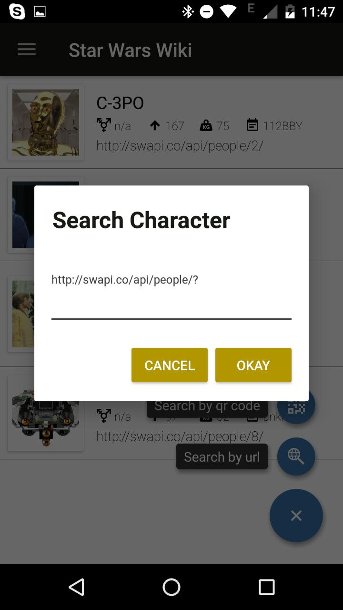
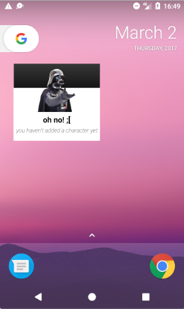
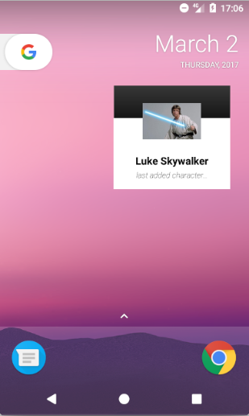
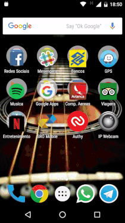

Supported languages:   

# Summary
1. [Introduction](#introduction) 
   * [Overview](#overview) 
   * [Requirements](#requirements) 
   * [Showcase](#showcase) 
   * [QR Code Samples](#qrcode-examples) 
2. [Architecture](#architecture) 
   * [Design Patterns](#design-patterns) 
   * [Quality Assurance](#tests) 
   * [Frameworks](#frameworks) 
   * [End Points](#end-points)
3. [Application Setup](#setup)   
4. [License](#license)


<a name="introduction" />

# Introduction

<a name="overview" />

## Overview
Create an application capable to read urls from Star Wars API, displaying these information in an application of type master-details. The requirements raised for this assignment shall test concepts of:
 1. Architectural design for Android Applications;
 2. Ability to communicate with complex end-points, parsing JSON responses and update UI;
 3. Data persistence and database manipulation;
 4. Sensor manipulation (camera);
 5. Permission requirement lifecycle;
 6. other.

<a name="requirements" />

<table>
  <tr>
    <td colspan="4" align="center"><b>Requirements</b></td>
  </tr>
  <tr>
  <td align="center"><b>ID</b></td>
  <td align="center"><b>Name</b></td>
  <td align="center"><b>Description</b></td>
  <td align="center"><b>Story Points</b></td>
  </tr>
  <tr>
    <td>REQ001</td>
    <td align="justify">Read QR Code</td>
    <td align="justify">Application must be able to read an URL from a QR Code image, storing the collected data locally</td>
    <td align="center">8</td>
  </tr>
  <tr>
    <td>REQ002</td>
    <td align="justify">Display character list</td>
    <td align="justify">Display to the user a list with all read characters containing, at least, character’s name and URL</td>
    <td align="center">3</td>
  </tr>
  <tr>
    <td>REQ003</td>
    <td align="justify">Display user details</td>
    <td align="justify">When click on a list item, application must display character’s details including a list of movies that that character was part of. Among the details, show: User’s geolocation at the time when that QR Code was read; Film’s poster;</td>
    <td align="center">5</td>
  </tr>
  <tr>
    <td>REQ004</td>
    <td align="justify">Collect user’s geolocation</td>
    <td align="justify">Store user’s geolocation on local database at the moment that the QR Code is read</td>
    <td align="center">2</td>
  </tr>
  <tr>
    <td>REQ005</td>
    <td align="justify">Allow user to navigate to film website</td>
    <td align="justify">When user taps on movie’s poster, application must redirect the user to film’s website</td>
    <td align="center">1</td>
  </tr>
  <tr>
    <td>REQ006</td>
    <td align="justify">Allow information caching</td>
    <td align="justify">All information once loaded from web into app must be persisted locally and accessible offline</td>
    <td align="center">5</td>
  </tr>
  <tr>
    <td>REQ007</td>
     <td align="justify">Allow URL typing to gather character information</td>
     <td align="justify">In order to enable emulator use and automation testing app must provide another way to collect character information that doesn't make use of the camera sensor</td>
     <td align="center">3</td>
  </tr>
  <tr>
    <td>REQ008</td>
     <td align="justify">Create an App widget that displayes the laste added character</td>
     <td align="justify">As a showcase, create an Android Homepage Widget capable of displaying the last added character</td>
     <td align="center">5</td>
  </tr>
  <tr>
    <td>REQ009</td>
     <td align="justify">Internationalize the application</td>
     <td align="justify">Add support for portuguese language</td>
     <td align="center">2</td>
  </tr>
   <tr>
    <td>REQ010</td>
     <td align="justify">Add URl validation</td>
     <td align="justify">When user attempts to read a QR Code that contains an unexpected data - or types an unexpected URL - gracefully fail the operation</td>
     <td align="center">2</td>
  </tr>
</table>

<a name="showcase" />

## Showcase

<p align="center">
  
  
  
  
  <br /><br />
  
  
  
  
  
</p>

<a name="qrcode-examples" />

## QR Code Samples

<p align="center">
  
  
  <br />
  <b>Figure 01:</b> sample qr codes generated on: http://br.qr-code-generator.com/ 
</p>

_Individual images can be found [here](https://github.com/edsilfer/star-wars-wiki/tree/master/qrcodes)_

<a name="architecture" />

# Architecture
The application follows Model-View-Presenter (MVP) pattern:
 - **Model:** layer that holds classes that describe Business Objects. As an ORM (see Realm) is being used, these classes also acts as template for generating the database. Despite these core business objects, model layer also provides enums that helps controlling the application logical flow in an elegant way and dictionaries. Dictionaries are POJO classes that matches the structure of the JSON returned as response from different API requests. Once filled, the dictionary can be dumped into a core object for persistence. In some cases, the need of this extra layer can be ignored, however, with the current limitation from Realm, it is an easy workaround that do not add overhead on the actual scenario;
 - **View:** the view layer is passive - as per [this](https://martinfowler.com/eaaDev/PassiveScreen.html) article on Martin Fowler’s blog - it means, it doesn’t contain business rules that decide when to trigger UI changes but, instead, it does perform the action of triggering these changes. This layer is composed by Activities, Fragments, Adapters and the associate XML, .mnu, and other resource files that they bind to. All view classes passes the events derived from user’s interaction with the UI to the Presenter layer, responsible for processing the business rules that will in turn update the UI; 
 - **Presenter:** this layer is the mean term among model and view layer. It can be, in some cases, the messenger that deliver UI events to be processed by business objects on model layer or, it can process them itself. In this application, the Presenter layer is responsible to execute business rules and also trigger their outcome to view layer. Network event handling, must be executed on this layer.

Below there is a sequence diagram that shows the basic configuration of view and presenter layers on a typical activity or fragment:

<p align="center">
  
</p>


<a name="design-patterns" />

## Design Patterns
 - **Singleton**: this pattern is used mainly to offer a single instance of presenters for their respective views. Its implementation happens thanks to Dagger2 @Singleton annotation;
 - **Observer**: this pattern is largely used in order to issue network events that trigger database actions or UI updates. The variant employed is observed based on bus, being all call routed to a class that holds reference to all subscribers. The implementation of this pattern is owned by the author of this application and encapsulated on [Android Kotlin Support Library](https://github.com/edsilfer/android-kotlin-support);
 - **Delegate**: this pattern is used in more than one place in the Application, for instance, with Postman and Router classes. The idea is to decouple classes that play distinct roles in the app - as the ones responsible for network communication for instance. That way, if any maintenance is required on them it is not passed beyond the class that gather all calls;
 - **Factory**: the application uses Factory Pattern on default Dagger2 implementation as well as to acquire End Points references for instance;

<a name="tests" />

## Quality Assurance

<p align="center">
  
</p>

One of the most importants gains that the MVP pattern brings to the project is the fact that all business logic gets isolated on Presenter Layer, it means, all code worthy to be tested is well encapsulated on classes with low dependency on OS components. This pattern alied with a Dependency Injection Container and Mock Frameworks (such as [Mockito](http://site.mockito.org/) and [PowerMockito](https://github.com/powermock/powermock/wiki/mockitousage)) allows the developer to take full advantage of Unit Tests.   

Despite the good coverage - over the classes that are worthy testing - it is always a good idea to include automation tests on the project. Currently, the offical adviced automation tool is [Espresso](https://google.github.io/android-testing-support-library/docs/espresso/) that counts with a faboulous tool embbeded on Android Studio that lets the developer record automation steps while manipulation the app as an user. In order to develop this concept, the following story was created:

<table>
  <tr>
    <td colspan="2" align="center"><b>Test Scenarios</b></td>
  </tr>
  <tr>
  <td align="center"><b>ID</b></td>
  <td align="center"><b>Description</b></td>
  </tr>
  <tr>
    <td>S001</td>
    <td align="justify">As an user I should be able to:<br />  - start the application;<br /> - click on left corner menu to manually insert a character's URL;<br /> - Type the URL and hit okay;<br /> - See that the application has loaded the information correponding the typed URL on the screen;<br /> - Long press over recently added character and choose to remove it from list;<br /> - Check that the application has successfully removed the character from the list;<br /></td>
  </tr>
</table>
<br />
<p align="center">
  <br /><br />
    <b>Figure 02:</b> sample automation test generated using Espresso
 </p>

<a name="frameworks" />

## Frameworks
 - [**Kotlin**](https://kotlinlang.org/): Kotlin is free to use and owned by Jet Brains. It adds a lot of cool features, boosting your productiveness while keeping everythying 100% compatible with Java;
 - [**Realm Mobile Database**](https://realm.io/products/realm-mobile-database/): _“(...) Realm Mobile Database is an alternative to SQLite and Core Data. Thanks to its zero-copy design, Realm Mobile Database is much faster than an ORM, and often faster than raw SQLite. Get started in minutes, not hours…”_
 - [**Retrofit**](https://square.github.io/retrofit/): _"(...) A type-safe HTTP client for Android and Java;
     - [**OkHttp**](http://square.github.io/okhttp/): “(...) HTTP is the way modern applications network. It’s how we exchange data & media. Doing HTTP efficiently makes your stuff load faster and saves bandwidth.
       OkHttp is an HTTP client that’s efficient by default:
          - HTTP/2 support allows all requests to the same host to share a socket.
          - Connection pooling reduces request latency (if HTTP/2 isn’t available).
          - Transparent GZIP shrinks download sizes.
          - Response caching avoids the network completely for repeat requests.
        
        OkHttp perseveres when the network is troublesome: it will silently recover from common connection problems. If your service has multiple IP addresses OkHttp will attempt alternate addresses if the first connect fails. This is necessary for IPv4+IPv6 and for services hosted in redundant data centers. OkHttp initiates new connections with modern TLS features (SNI, ALPN), and falls back to TLS 1.0 if the handshake fails.
        Using OkHttp is easy. Its request/response API is designed with fluent builders and immutability. It supports both synchronous blocking calls and async calls with callbacks. OkHttp supports Android 2.3 and above. For Java, the minimum requirement is 1.7…”_
     - [**Gson**](https://github.com/google/gson): _“(...) A Java serialization/deserialization library that can convert Java Objects into JSON and back…”_
     - [**RxAndroid**](https://github.com/ReactiveX/RxAndroid): _“(...) ReactiveX is a combination of the best ideas from the Observer pattern, the Iterator pattern, and functional programming...”_
 - [**Dagger 2**](https://google.github.io/dagger/): a dependency Injector for Android and Java, used to grant one of the S.O.L.I.D. principles for OO programming (Dependency Inversion Principle). Besides allowing the high level class to not depend upon low level ones, it makes Unit Test easier to perform with the help of a mocking framework i.e. Mockito;
 - **Other**:
     - [**Barcode Scanner**](https://github.com/dm77/barcodescanner): _"(...) Android library projects that provides easy to use and extensible Barcode Scanner views based on ZXing and ZBar..."_
     - [**Data bind**](https://developer.android.com/topic/libraries/data-binding/index.html): “(...) The Data Binding Library offers both flexibility and broad compatibility — it's a support library, so you can use it with all Android platform versions back to Android 2.1 (API level 7+)...”
 
<a name="end-points" />

## End points
 - [**Star Wars API**](https://swapi.co/): _“(...) The Star Wars API, or "swapi" (Swah-pee) is the world's first quanitified and programmatically-accessible data source for all the data from the Star Wars canon universe! We've taken all the rich contextual stuff from the universe and formatted into something easier to consume with software. Then we went and stuck an API on the front so you can access it all!...”_
 - [**Google Custom Search**](https://developers.google.com/custom-search/): _“(...) Google Custom Search enables you to create a search engine for your website, your blog, or a collection of websites. You can configure your engine to search both web pages and images. You can fine-tune the ranking, add your own promotions and customize the look and feel of the search results. You can monetize the search by connecting your engine to your Google AdSense account…”_
 <a name="tmdb" />
 
 - [**The Movie DB**](https://www.themoviedb.org/): _“(...) The Movie Database (TMDb) is a community built movie and TV database. Every piece of data has been added by our amazing community dating back to 2008. TMDb's strong international focus and breadth of data is largely unmatched and something we're incredibly proud of. Put simply, we live and breath community and that's precisely what makes us different…”_

<a name="setup" />

# Application Setup
This application relies on three different [end points](#end-points) plus on Google Services in order to fufill the requirements. These APIs require some sort of authentication in order to allow requests. These ids are tied to develepor's account on the reffered platforms. In order to make this application work, follow the steps below:

1. Clone the repository to your local machine;
2. Create an account on Firebase Console and download Google Play Service configuration file - named ```google-services.json``` - placing it on ```~/app```. This is need in order to capture user's location and to send crash report to Firebase;
3. Create an account on [The Moview DB](#tmdb) and acquire an API key;
4. Go into Google Custom Search console and activate the API key for using this service;
5. Create a file named ```config.properties```with the content below and add it on ```~/app/src/main/assets```;

```properties
gcs.application.key=*****
gcs.api.key=*****
tmdb.api.key=*****
```

After that application must be set to work properly. In case ```config.properties```is not present or wrongly configured, application might freeze on loading dialog that shows after reading an URL and throw the followinf stacktrace:

```log
java.lang.IllegalStateException: Fatal Exception thrown on Scheduler. at io.reactivex.android.schedulers.HandlerScheduler$ScheduledRunnable.run(HandlerScheduler.java:111)
```


<a name="license" />

## License
Copyright 2017 Edgar da Silva Fernandes

Licensed under the Apache License, Version 2.0 (the "License");
you may not use this file except in compliance with the License.
You may obtain a copy of the License at

    http://www.apache.org/licenses/LICENSE-2.0

Unless required by applicable law or agreed to in writing, software
distributed under the License is distributed on an "AS IS" BASIS,
WITHOUT WARRANTIES OR CONDITIONS OF ANY KIND, either express or implied.
See the License for the specific language governing permissions and
limitations under the License.

